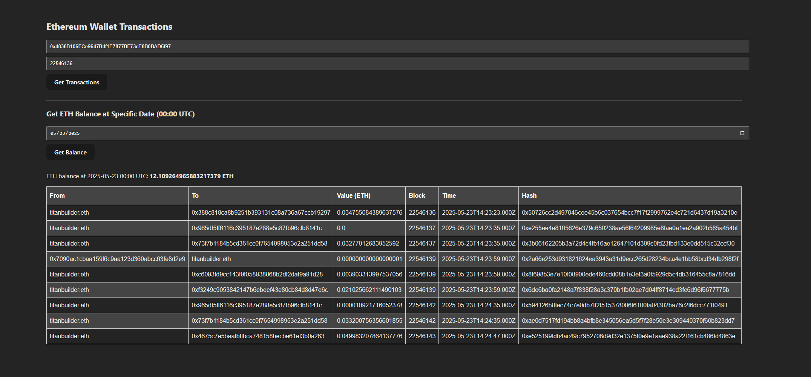

## Ethereum Transactions Crawler Task Guide




**Ethereum Transactions Crawler**
is a web-based application that allows users to explore Ethereum blockchain transactions associated with any wallet address. By inputting a wallet address and a starting block number, the app retrieves and displays all related transactions in a table.

Additionally, users can input a specific date in `YYYY-MM-DD` format to view the **exact ETH balance** that was available at `00:00 UTC` on that date for the given wallet.

---

**Wallet & Block Lookup**: Input a wallet address and block number to fetch all ETH transactions from that block to the current one.
**Readable Table**: Results are displayed in a simple, tabular format showing:
  - From and To addresses
  - Amount of ETH transferred
  - Transaction hash and timestamp
**Date-Based ETH Balance** *(Bonus Feature)*: Enter a date to get the ETH balance at `00:00 UTC` for the selected wallet address.

---

## Tech Stack

    Node.js
    React + Vite

    Express
    Axios (api calls)
    Ethers
---

## Download

1. **Prerequisites**
    Node.js


2. **Clone the repository**  
   ```bash
   git clone https://github.com/Nidzas1/EthereumWalletCrawler
   cd EthereumWalletCrawler

3. **Create a .env File**
    create a .env file in the root directory with the following content:
    ```bash
    INFURA_URL=https://mainnet.infura.io/v3/YOUR_PROJECT_ID
    PORT=3000
    Replace YOUR_PROJECT_ID with your actual Infura project ID. You can obtain it by registering at https://infura.io

4. **Install dependencies**
   ```bash
    npm install

5. **Run program**
    ```bash
    npm run dev
    node server.js 

## Notes
It is strongly recommended to use recent block numbers and wallet addresses when testing, as the application relies on live API calls to the Ethereum blockchain. This ensures faster and more accurate responses.